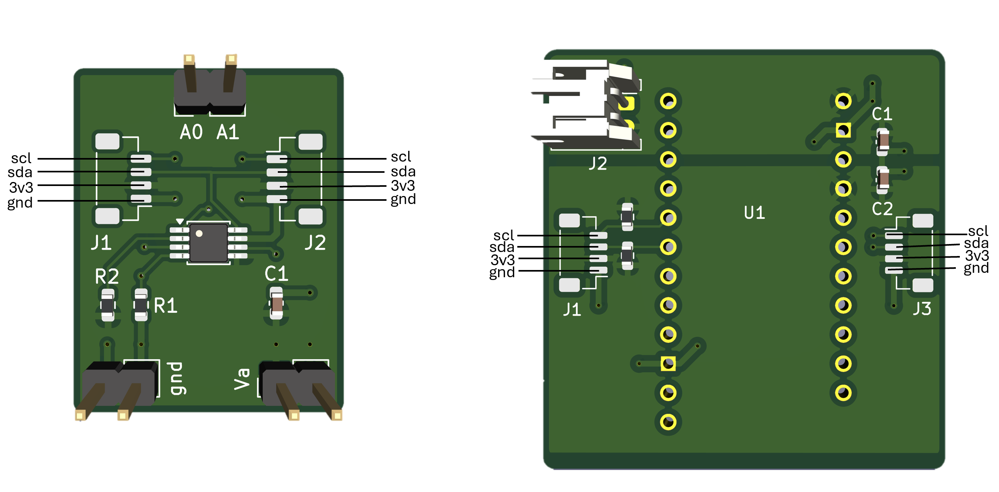
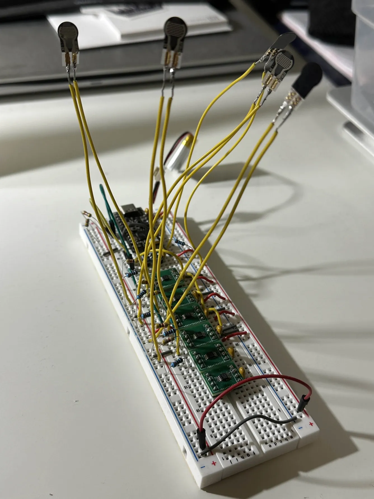
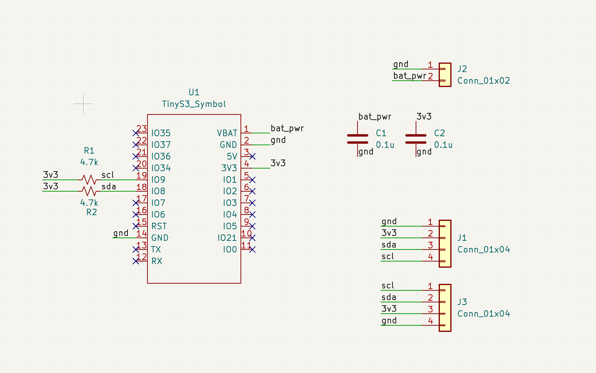
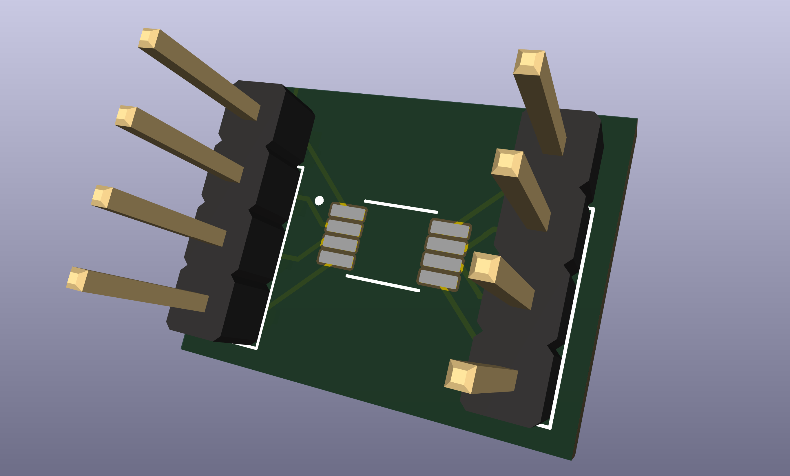

# Wearable Device Pipeline for Biopotential Signal Acquisition

## Overview
### Objective
Designing an embedded wearable device pipeline as a modular application for registering biopotential signal acquisition and wireless data transmission to a computer application for prosthetic rehabilitation applications.

First step is to build a device prototype only using Force myography (FMG) as the main modality of sensing. I will eventually move on to capturing electromyography (EMG) signals, which are more complicated and require more hardware filtering. 

### Built with: 
#### *Software*
- C++
- C
- ESP-IDF Driver
- FreeRTOS
  
#### *Hardware*
| Part | Quantity 
|:-----|:-----|
| ESP32 TinyS3 MCU | 1
| 3.7V LiPo Battery | 1
| FSR400 sensors | 8
| ADC121C021 12-Bit ADC w/ I2C Interface | 8
| Custom Breakout Board for ADC121C021 | 8
| 4.7kΩ Resistor | 10
| 100uF Capacitor | 10
| JST_SH_BM04B-SRSS-TB_1x04 | 16
| JST_PH_S2B-PH-K_1x02 | 1

## **Current State** 
With this design and files in this repository, we are able to:
- Have a motherboard designed around the ESP32-TinyS3 microcontroller using 3.3V power input.  A custom PCB was designed for interfacing with the TinyS3 MCU
soldered directly onto the board.
- Collect voltage readings indicating pressure levels from 9 different sensing daughterboards with unique identifier addresses.
- Send sensor data via USB or Bluetooth. Run MATLAB scripts to get data and plot it.
- Place circuitry in mechanical casing

## **Set-up**
1. Download the [ESP-IDF Tools](https://docs.espressif.com/projects/esp-idf/en/stable/esp32/api-guides/tools/idf-tools.html).
2. Solder ESP32-TinyS3 MCU on custom PCB to make motherboard
4. Assemble daughterboards
   - Solder jumper pins
   - Super glue FSR on back of PCB to align the FSR legs with solder pad
   - Solder legs of FSR
   - Place silicone bumper on FSR      
6. Flash code onto MCU
7. Connect 4-pin JST connectors between motherboard and daughterboards. Ensure terminals line up.

  

## Design Phases and Decisions

### **Phase 1**: Breadboard prototype with FMG sensors  

  

- **Design Decisions:**
  1. **Connect force sensors along I²C bus lines**  
     This approach ultimately eliminates extra wiring and enables modularity, allowing different sensor types to be swapped in and out of the band.  
     Drawback is that I²C is slower than other alternatives such as SPI sensor interfaces or direct ADC pin connections. However, using I²C ensures that the number of available ADC pins on the MCU does not limit the number of sensor channels, allowing for future expansion if additional sensors are added. While adding more sensors does increase I²C bus latency, the physical space constraints of the band inherently cap the number of sensors that can be placed. As a result, the latency will remain well within acceptable limits for our data acquisition requirements.

2. **Using FreeRTOS queue to store sensor data**
   Using a FreeRTOS queue allows sensor data to be passed between tasks in a thread-safe and time-decoupled (meaning sampling task and BLE task don't need to run at the same rate) way. Unlike writing FSR readings directly into a shared array, a queue transfers each sample as a complete set of all sensor readings at a time, preventing race conditions where BLE might read partially updated data. The queue also buffers samples when BLE transmission is delayed, letting the sensor task run at a stable rate without blocking. 

### **Phase 2**: Migrating to PCB prototype  
- **PCB Design: MCU Daughter Board**

  

  

  
## Challenges
### 1. Ghosting ADC Pins
Ghosting ADC pins (when originally only used the analog pins and not the I2C busline to read in sensor input). When one sensor had pressure applied to it, the readings for all the other sensors would indicate that they were experiencing pressure being applied as well (despite that being the case). Internally, the ADC samples each channel by briefly connecting it to a shared sample-and-hold capacitor. When the sampling switch closes, this capacitor must charge (or discharge) to the input voltage within the available sampling window.
Because the FSR sensors present a high source impedance, the effective RC time constant formed with the ADC’s internal sample-and-hold capacitor becomes large. As a result, the capacitor cannot fully settle to the correct voltage before conversion. When the ADC rapidly switches between channels, residual charge from the previously sampled channel can be injected into the next channel, producing ghosting and cross-channel couplingI realized that the issue had to due with a high impedence inputBy reading the datasheet for the ESP32-S2, it can be directly inferred that there is only one internal mux and a Share-Hold capacitor that all ADC pins are connected to. Therefore, when the ADC switches channels the S/H cap and internal mux briefly share the same internal node. The fact that the ESP32 ADC lacks strong internal input buffering, making it sensitive to source impedance.

*Solution*: Adding small capacitors at each ADC input to stabilize the voltage and provide a local charge reservoir for the internal sample-and-hold capacitor

### 2. Part Selection
I²C-interface ADC IC components within acceptable voltage range only offered as SMD components. For breadboard and protoboard steps, required finding suitable breakout board to connect. Bought MCP3221 from Microchip but that component ended up only being able to be configured to 1 unique slave address. Originally was going to use a multiplexer but that would be less efificent than finding a new I²C-interface ADC IC part. Ended up choosing to use ADC121c021 from Texas Instruments, which has 8 configurable slave addresses. 

  

### 3. Learning New Tools and Technologies
1. Learning PCB design with KiCAD
2. Understanding how BLE is configured
3. How to use FreeRTOS to manage multiple tasks and the general hierarchy of how the OS interacts with ESP drivers.

