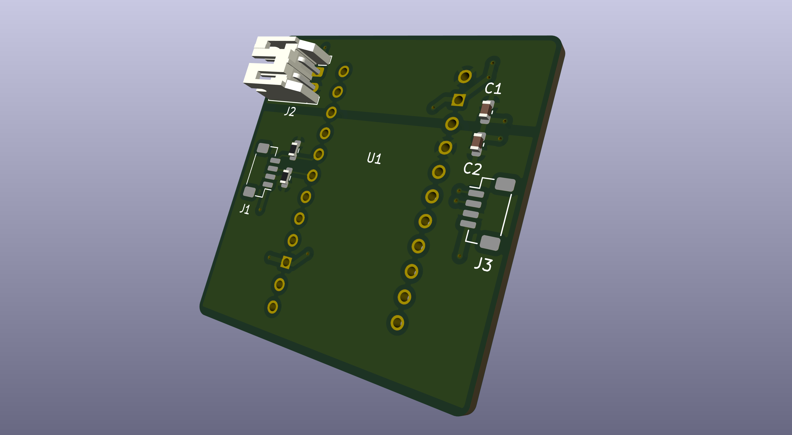

# Wearable Device Pipeline for Biopotential Signal Acquisition

## Overview
### Objective
Designing an embedded wearable device pipeline as a modular application for registering biopotential signal acquisition and wireless data transmission to a computer application for prosthetic rehabilitation applications.

### Built with: 
#### *Software*
- ESP-IDF Driver
  
#### *Hardware*
| Part | Quantity 
|:-----|:-----|
| ESP32 TinyS3 MCU | 1
| 3.7V LiPo Battery | 1
| FSR400 sensors | 8
| ADC121C021 12-Bit ADC w/ I2C Interface | 8
| Custom Breakout Board for ADC121C021 | 8
| 4.7kΩ Resistor | 10
| 100uF Capacitor | 10
| JST_SH_BM04B-SRSS-TB_1x04 | 16
| JST_PH_S2B-PH-K_1x02 | 1

## **Current Progress** 
**I will update this as I go :D

At this point, I have a breadboard prototype that includes:
- Selected necessary electronic componenets to build the system. Developed break-out boards required to connect SMD components to through-hole breadboard system. 
- Wired ADC IC's to an I2C busline and developed firmware code that communicates with the ICs slave addresses to read in force sensor data
- Use FreeRTOS to schedule tasks that collect data from force sensors and send that data to MATLAB wirelessly over BLE.
- Designed PCB of daughterboard that MCU will rest on top of for next stage of prototyping. 

## Design Phases and Decisions

**Phase 1**: Breadboard prototype with FMG sensors  
- **Design Decisions:**
  1. **Connect force sensors along I²C bus lines**  
     This approach ultimately eliminates extra wiring and enables modularity, allowing different sensor types to be swapped in and out of the band.  
     Drawback is that I²C is slower than other alternatives such as SPI sensor interfaces or direct ADC pin connections. However, using I²C ensures that the number of available ADC pins on the MCU does not limit the number of sensor channels, allowing for future expansion if additional sensors are added. While adding more sensors does increase I²C bus latency, the physical space constraints of the band inherently cap the number of sensors that can be placed. As a result, the latency will remain well within acceptable limits for our data acquisition requirements.

**Phase 2**: Breadboard prototype with FMG sensors  
- **PCB Design: MCU Daughter Board**

  

  

  
## Challenges
### Part Selection
1. I²C-interface ADC IC components within acceptable voltage range only offered as surface mount units. For breadboard and protoboard steps, required finding suitable breakout board of size S023-5 to connect. Bought MCP3221 from Microchip but that component can only be configured to have 1 unique slave addresses. Originally was going to use a multiplexer but that would be less efificent than finding a new I²C-interface ADC IC part. Ended up choosing to use ADC121c021 from Texas Instruments, which has 8 configurable slave addresses. 

